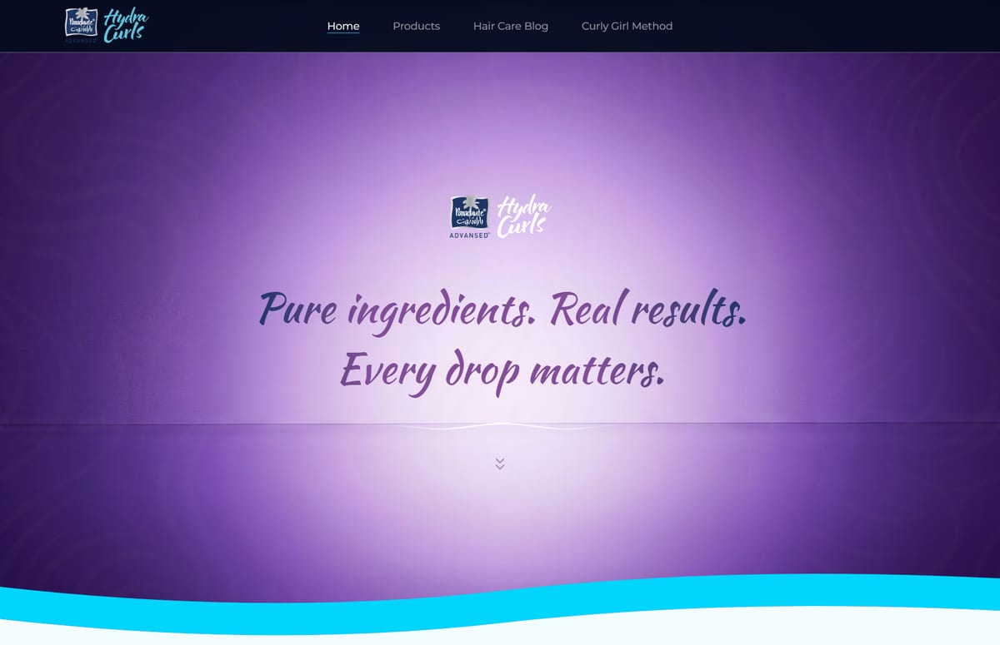
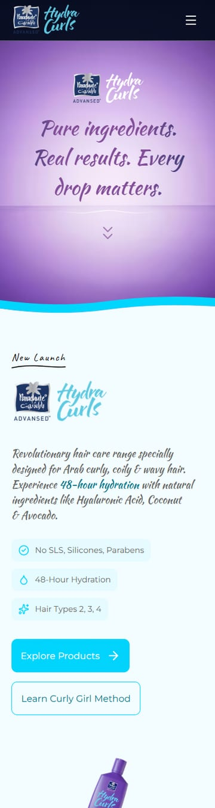

# Hydra Curls — Figma to React

Assignment 1 of the Moksha AI Full Stack Developer technical assignment: a 1920 × 15,249px Figma
landing page for _Parachute Advanced — Hydra Curls_, rebuilt as a responsive React application.

**Live:** <https://moksha-hydra-curls.vercel.app>
**Design source:** [Figma file](https://www.figma.com/design/Yqq9qC4hZqj0adhv5kJUNG/Untitled?node-id=1-503) · frame `1:503`





---

## Running it

```bash
npm install
npm run dev          # http://localhost:5173
```

```bash
npm run build        # typecheck, bundle, prerender to static HTML
npm run preview      # serve the production build on :4173
```

| Script          | What it does                                                          |
| --------------- | --------------------------------------------------------------------- |
| `dev`           | Vite dev server                                                       |
| `build`         | `tsc -b` → client bundle → SSR bundle → prerender + inline CSS        |
| `preview`       | Serves `dist/`                                                        |
| `typecheck`     | `tsc -b --noEmit`                                                     |
| `lint`          | oxlint                                                                |
| `format`        | Prettier over `src/`                                                  |
| `images`        | Re-encode Figma assets to AVIF/WebP and regenerate the asset manifest |
| `fonts`         | Copy the Latin woff2 subsets into `public/fonts/`                     |
| `figma:extract` | Re-download the node tree and image fills (needs `FIGMA_TOKEN`)       |
| `figma:slices`  | Regenerate the per-section reference slices locally, no API calls     |
| `format:check`  | Prettier in check mode                                                |

Node 22. No environment variables are needed to build or run — the Figma token is only for
re-running the extraction, and its output is committed in derived form.

---

## Stack, and why

| Choice                    | Reason                                                                                                                                                                                                                                                                                |
| ------------------------- | ------------------------------------------------------------------------------------------------------------------------------------------------------------------------------------------------------------------------------------------------------------------------------------- |
| **Vite 8**                | The brief asks for a React _page_, not an application. Next.js would be a framework's worth of weight for one static route. (The one thing it would have given us — static HTML — is covered below.)                                                                                  |
| **React 19 + TypeScript** | Required. `strict`, plus `noUncheckedIndexedAccess` and `exactOptionalPropertyTypes`. No `any` in the codebase.                                                                                                                                                                       |
| **Tailwind CSS v4**       | Required. Its CSS-first `@theme` block maps the design tokens directly to custom properties, so the design system lives in one file and every utility derives from it.                                                                                                                |
| **shadcn/ui**             | Required "where appropriate". Used for the three places that genuinely need a component — `Sheet` (mobile nav), `Carousel` (product + testimonials), `Input` (newsletter). Deliberately _not_ used for the marketing layouts, which are bespoke and would only have been fought with. |
| **lucide-react**          | Ships with shadcn, tree-shakes, and matches the icon sets Figma referenced.                                                                                                                                                                                                           |
| **sharp**                 | Build-time image pipeline. Never runs in the browser.                                                                                                                                                                                                                                 |
| **Playwright**            | Screenshot and layout-regression harness (dev only).                                                                                                                                                                                                                                  |

**No animation library.** Motion/Framer would be ~30KB of JavaScript and more main-thread work on
a page whose performance profile is already dominated by style and layout. Everything in Phase 2
is CSS transitions and keyframes plus one ~60-line inline script.

---

## How it is put together

```
src/
├── components/
│   ├── ui/           shadcn — generated, not hand-edited
│   ├── layout/       Container, Section, Navbar, Footer
│   ├── primitives/   Picture, Eyebrow, SectionHeading, BrandButton, Chip,
│   │                 FeatureBadge, StatBlock, CurvedText, WaveDivider, ScrollCue
│   └── sections/     one file per band, in page order
├── content/          every string the page renders, typed
│   └── assets.generated.ts   image manifest (generated — do not edit)
├── styles/globals.css        the only file containing a raw hex value
├── islands.tsx       the three components that hydrate in the browser
└── entry-server.tsx  build-time render
```

Two rules hold throughout, and they are what make the section files short:

- **Content is data.** No copy string appears in JSX. Sections import typed arrays from
  `src/content/` and map over them.
- **Colour and type are tokens.** `globals.css` is the only place a hex value or a font size is
  written. Sections carry no breakpoint-specific font sizes — the scale is `clamp()`-based and
  interpolates between its 320px and 1920px values.

### Reading the design, not the node tree

The Figma file has **no auto-layout**: 47 flat, absolutely-positioned, overlapping nodes with
names like `Frame 71` and `Group 12173`. Nesting carries no meaning. Sections were derived from
the y-coordinate map and rebuilt with normal flow — a 1:1 translation into positioned divs looks
right at 1920px and falls apart everywhere else.

`scripts/inspect-node.mjs` prints a measured subtree (positions, fills, gradients, type styles),
so every value in the code came from the file rather than from eyeballing a PNG:

```bash
node scripts/inspect-node.mjs "Frame 75"     # by node name
node scripts/inspect-node.mjs 1199 2029      # by y-range
```

A few things that only showed up by measuring:

- The hero background is a **raster image fill**, not a CSS gradient.
- The hero headline's own fill is a **four-stop gradient** — `background-clip: text`, with a solid
  fallback so the text can never be invisible.
- The wavy overlays sit at **2% opacity**. They are texture, not pattern.
- The purple "band" behind the product carousel is the **underside of three concentric 2052px
  circles** whose crown is hidden behind the cards above. The 46px and 91px offsets on the
  translucent pair are what produce the pale rims.
- The product bottle carries a **0.34rad rotation** — invisible in the y-map, obvious in the render.
- Two colours the design spec omitted: `#34C759` (trust-badge ticks) and `#A2A2A2` (muted text).

### Curved text

Two passages are stored as **one node per glyph** — 48 rotated Kaushan Script nodes and 144 Inter
nodes. Rendering those as ~192 positioned spans would be unselectable, invisible to search
engines, and would shatter under a fluid type scale. `CurvedText` rebuilds them as a single SVG
`<textPath>`: real text, announced once, crisp at any size. Its API takes the two numbers actually
measurable from the file — the chord of the glyph run and how far its middle sags — and derives
the circle.

---

## Fonts

Three substitutions, all forced by licensing or by value:

| Figma                      | Shipped                    | Why                                                                                                                                                 |
| -------------------------- | -------------------------- | --------------------------------------------------------------------------------------------------------------------------------------------------- |
| Gotham 300/350/400         | **Montserrat** 300/400/500 | Gotham is a paid Hoefler face. Montserrat is the standard free geometric-sans stand-in with near-identical proportions.                             |
| Guthen Bloots Personal Use | **Caveat**                 | Licensed for personal use only; cannot ship commercially.                                                                                           |
| Kaushan Script             | Kaushan Script             | Free on Google Fonts, used as-is.                                                                                                                   |
| Inter                      | **Montserrat**             | Inter only set the watermark arcs, rendered at 6–40% opacity. A 47KB font file for type nobody reads was the worst byte-for-byte value on the page. |

Fonts are self-hosted from `public/fonts/`, copied out of the `@fontsource` packages at build time
by `scripts/copy-fonts.mjs`, rather than `@import`-ed from them. Vite content-hashes anything it
pulls from `node_modules`, which leaves no stable URL to preload — and the hero headline reflowing
when Kaushan Script arrived was the page's entire layout-shift budget.

---

## Responsive approach

Figma provides **one 1920px frame**. Tablet and mobile were designed from scratch, which is a real
part of the work rather than a detail.

|           | Approach                                                                                               |
| --------- | ------------------------------------------------------------------------------------------------------ |
| 320–767   | Single column. Hamburger nav in a Sheet. Heavy decorative art dropped.                                 |
| 768–1023  | Two-column card grids; side-by-side blocks stack.                                                      |
| 1024–1439 | Three-column grids, near-final layout.                                                                 |
| 1440–1919 | The designed layout.                                                                                   |
| 1920+     | Container caps at 1920 (1680 of content inside 120px margins); full-bleed art still runs edge to edge. |

Principles that keep it honest:

- Type is a `clamp()` scale, not a pile of breakpoint overrides.
- Designed line breaks apply from `md` up only — a break authored at 1920px lands mid-phrase at 320.
- Content never leaves the container; only decorative bands do, and they are clipped.
- Tap targets are ≥44px everywhere.

### Verifying it

`scripts/shoot.mjs` screenshots every breakpoint and reports what is tedious to check by eye:

```bash
npm run preview
SHOOT_URL=http://localhost:4173/ node scripts/shoot.mjs
```

```
 320px  h= 14709  ✓ no h-scroll  img 3/55 eager
 375px  h= 14858  ✓ no h-scroll  img 3/55 eager
 768px  h= 16039  ✓ no h-scroll  img 3/55 eager
1024px  h= 11287  ✓ no h-scroll  img 3/55 eager
1440px  h= 12973  ✓ no h-scroll  img 3/55 eager
1920px  h= 15005  ✓ no h-scroll  img 3/55 eager
```

It flags horizontal overflow with a CSS selector (ignoring art that is _meant_ to bleed and is
clipped), lists sub-44px tap targets, and prints the heading outline. The rendered page is
15,005px against the Figma frame's 15,249 — within 1.6%.

---

## Performance

|             | Performance | Accessibility | Best practices | SEO |
| ----------- | ----------- | ------------- | -------------- | --- |
| **Desktop** | 98–99       | **100**       | 100            | 100 |
| **Mobile**  | 92–99       | **100**       | 100            | 100 |

LCP 1.0s desktop / 2.3s mobile · **CLS 0** · TBT 0–80ms.

Mobile performance is sensitive to what else the measuring machine is doing: the same build scored
87–89 with a second heavy process running and 98–99 once it stopped. LCP (2.3s) and CLS (0) held
steady across every run, so those are the numbers to trust.

### What the page does

- **Prerendered to static HTML.** The build renders the tree with `react-dom/server`, inlines the
  stylesheet, and replaces the module script with a loader that fires on first idle _or_ first
  interaction. Nothing waits on ~100KB of JavaScript to paint. This is the one thing Next.js would
  have given us, in about 90 lines.
- **Islands.** Only three components hydrate — the mobile menu and the two carousels. The rest is
  static markup and stays that way.
- **Images.** 40 assets (39 from the Figma file plus one derived at build time), AVIF + WebP across
  a width ladder, with a small JPEG/PNG floor. Every `` gets intrinsic dimensions from a
  generated manifest, which is why CLS is 0 across all 55 of them. A mistyped asset name is a
  compile error, not a 404.
- **Motion is composited.** Only `transform` and `opacity` are animated, so no animation can
  trigger layout. `prefers-reduced-motion` is honoured globally, and the reveal script exits before
  it ever adds a hidden state.
- **Two raster icons became one SVG.** The 48-hour clock shipped as two flat PNGs with its hands
  baked in. Redrawn as SVG it animates, scales cleanly, and costs two fewer image requests.

### Three optimisations rejected on measurement

Each is recorded in `PROGRESS.md` with its reason, so they are not re-attempted:

- **`content-visibility: auto`** on below-fold bands bought ~3 points, but offscreen bands are then
  genuinely unrendered — full-page screenshots and print come out blank below the fold. A bad trade
  for a page whose purpose is to be looked at.
- **A shorter srcset ladder** made the HTML smaller but pushed phones onto larger renditions; LCP
  went _up_ ~1s.
- **Code-splitting the carousels** saved ~10KB but, on a prerendered page, put a placeholder in the
  HTML and shifted the layout when the chunk landed (CLS 0 → 0.067).

### Accessibility reached 100 without repainting the brand

Cyan set as _type_ on the pale background measured 1.7:1 and now clears WCAG at both the large-text
and body-text thresholds. The last failure was the "Hours" tag — white on `#00D5FD` at 1.75:1.
Rather than darken the tag and lose the brand colour, the label flips to ink: the cyan is
reproduced exactly and the text clears AA with room to spare.

---

## Accessibility

- Semantic landmarks, one `<h1>`, ordered headings, no skipped levels.
- Every image has meaningful `alt`, or `alt=""` where decorative. The campaign banner has all of
  its baked-in typography transcribed, since a screen-reader user would otherwise lose every claim
  the band makes.
- Keyboard reachable throughout, with a visible high-contrast `:focus-visible` ring.
- Stat figures are description lists, so "48" is announced with "Hours" rather than alone.
- The carousel announces the active product via `aria-live`.
- `prefers-reduced-motion: reduce` disables every animation, and reveals never hide anything.

---

## Deployment

**<https://moksha-hydra-curls.vercel.app>**

Deployed on Vercel. Build command `npm run build`, output directory `dist`, no environment
variables required.

---

## AI tools used, and how

Built with **Claude Code** (Opus) driving the whole implementation — this repository's commit
history is the session.

Where it did the real work:

- **Reading the design programmatically instead of by eye.** Rather than squinting at a PNG, it
  wrote `inspect-node.mjs` to query the Figma node tree and ran a colour census (28 fills) and a
  type census (26 combinations) across the whole file. Every token in `globals.css` came from that,
  including two colours the hand-written design spec had missed.
- **Building its own verification harness.** `shoot.mjs` — screenshots at six breakpoints plus
  overflow, tap-target and heading-outline checks — was written because checking those by hand
  sixteen times is exactly the kind of thing that gets skipped.
- **Catching its own bugs.** Two were only found by measuring: `tailwind-merge` silently dropping
  every section heading to 16px because it classified `text-h2` as a colour, and an
  IntersectionObserver leaving 20 of 34 elements permanently hidden on a fast scroll.

Where it needed correcting — worth stating plainly:

- It destroyed the working directory early on by passing `--overwrite` to a scaffolder in a
  populated folder. Recovery was manual; the rule that followed is now the first section of
  `CLAUDE.md`.
- It twice "fixed" problems that were artefacts of its own screenshot harness rather than the page
  (Chrome does not paint lazy images or `content-visibility` content in full-page captures).
- Several optimisations it reasoned were improvements measured _worse_ and were reverted. The
  measurements, not the reasoning, decided.

The honest summary: it was very effective at the mechanical work — measuring, generating,
verifying at scale — and needed a human standard held over what "done" and "better" meant.

---

## Time taken

**Roughly 4.5 hours** of implementation for this assignment, from scaffold to Phase 2 complete
(git history spans 14:53–18:45 plus orientation before the first commit). Figma extraction and the
design spec were prepared separately beforehand and are not counted here.

---

## Deliberate deviations from the design

Every one of these is a considered choice, not an accident:

| What                                                                           | Why                                                                                                                                                                                                                                 |
| ------------------------------------------------------------------------------ | ----------------------------------------------------------------------------------------------------------------------------------------------------------------------------------------------------------------------------------- |
| Cyan **text** on pale backgrounds darkened; the "Hours" tag's label set in ink | `#00D5FD` as type measures 1.7:1. The brand colour is reproduced exactly everywhere it is a _surface_ — only type on top of it moved.                                                                                               |
| Navbar is transparent over the hero                                            | A navy strip butting against the hero's purple read as two unrelated surfaces. It takes its solid background as soon as you leave the top.                                                                                          |
| Four testimonials authored                                                     | Figma ships one quote placed twice. With two identical cards in a two-up viewport the design's own prev/next buttons were permanently disabled — a designed control that looked broken. This is the only authored copy on the page. |
| Announcement ticker made visible                                               | Its text node sits at x1950, off-canvas past the 1920 frame and invisible in the export.                                                                                                                                            |
| Hair-type CHARACTERISTICS panel on hover                                       | Figma parks it outside the card bounds and the reference render does not show it. Kept as a hover overlay so the copy is not discarded, hidden with opacity so it stays in the accessibility tree.                                  |
| Soft wave dividers between bands                                               | The reference render curves several section boundaries that a plain background change renders as straight lines.                                                                                                                    |

## Known gaps

- The brand key visual renders ~8% larger than the reference export; same asset, same cover crop,
  cause not identified. Within tolerance and not chased further.
- `scripts/figma-geometry.mjs` never completed — the Figma token stayed rate-limited, so the wave
  divider ships with a hand-traced path rather than the file's exact geometry.
