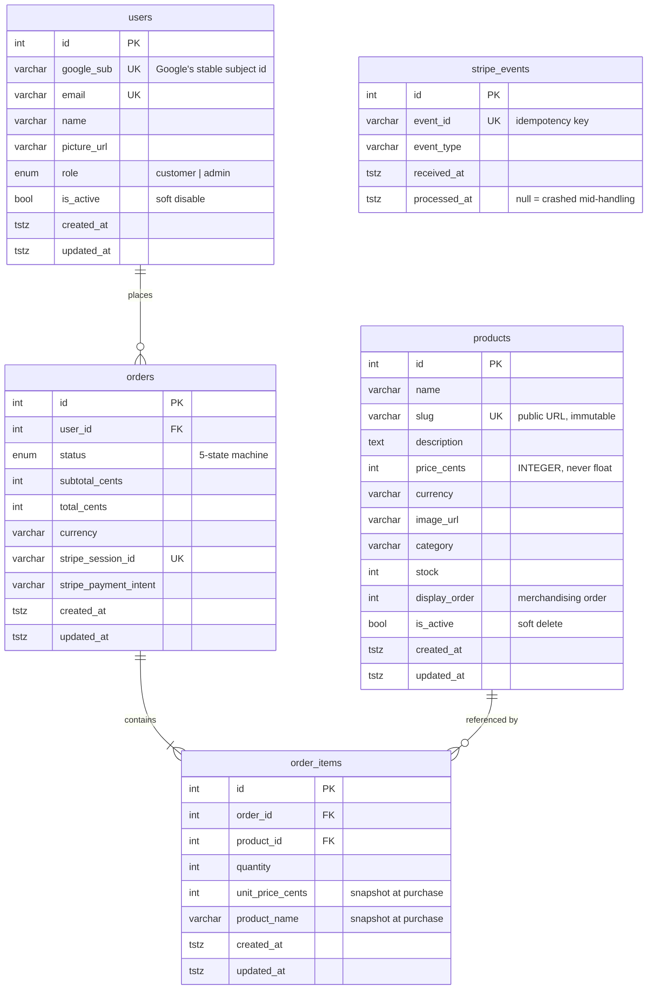

# Database schema

PostgreSQL 16. Five tables. Every column below exists for a reason that is stated — the point of
this document is not to restate the DDL (which Alembic already holds) but to record *why* each
decision was made, so it can be defended rather than merely described.

Source of truth: `backend/app/models/`. Migrations: `backend/alembic/versions/`.

---

## Entity relationships



`stripe_events` has no foreign keys by design — it is an append-only ledger of *deliveries*, not
of business objects, and it must be writable before we know which order an event refers to.

---

## Why PostgreSQL and not MongoDB

The brief allows either. Two requirements decided it:

1. **Stock and orders want a transaction.** Decrementing stock and creating the order must both
   happen or neither. In Postgres that is one `BEGIN … COMMIT`.
2. **The oversell problem wants a row lock.** `SELECT … FOR UPDATE` is the correct answer to two
   customers buying the last unit simultaneously. Mongo's equivalent is either a single-document
   design that fights the shape of the data, or a multi-document transaction — which gives up the
   thing Mongo was chosen for.

A third, smaller reason: a relational schema produces a real migration history and an ER diagram,
and "database schema" is one of the eight listed deliverables.

---

## `users`

| Column | Type | Notes |
|---|---|---|
| `id` | `serial` PK | |
| `google_sub` | `varchar(255)` **unique, indexed** | Google's stable subject identifier |
| `email` | `varchar(320)` **unique, indexed** | 320 = RFC 5321 maximum |
| `name` | `varchar(255)` | refreshed from Google on every sign-in |
| `picture_url` | `varchar(1024)` nullable | |
| `role` | `enum('customer','admin')` | default `customer` |
| `is_active` | `boolean` | default `true` |
| `created_at`, `updated_at` | `timestamptz` | database-maintained |

**Why `google_sub` and not just email.** A Google account can change its email address; the `sub`
never changes. Matching on `sub` is what keeps a returning user attached to their existing orders
after they change their address. Lookup falls back to email second, which is what lets the seeded
demo accounts adopt their real Google identity on first sign-in instead of colliding on the unique
email index.

**Why `is_active` rather than `DELETE`.** Deleting a user would orphan their orders. An order has
to survive as a financial record regardless of what happens to the account.

**Why the role lives here but is assigned from an env var.** `role` is stored so a JWT can carry it
and RBAC needs no join — but it is *recomputed* from `ADMIN_EMAILS` on every sign-in. Privilege
therefore cannot be escalated by writing to the database, only by changing deployment config.

Index: `ix_users_role_created_at (role, created_at)` — covers the admin user listing.

---

## `products`

| Column | Type | Notes |
|---|---|---|
| `id` | `serial` PK | |
| `name` | `varchar(255)` | |
| `slug` | `varchar(255)` **unique, indexed** | the public URL; not updatable |
| `description` | `text` | |
| `price_cents` | `integer` | **CHECK ≥ 0** |
| `currency` | `varchar(3)` | ISO 4217, default `INR` |
| `image_url` | `varchar(1024)` nullable | |
| `category` | `varchar(64)` **indexed** | lower-cased on write |
| `stock` | `integer` | **CHECK ≥ 0** |
| `display_order` | `integer` | default `100`; lower sorts first |
| `is_active` | `boolean` **indexed** | soft delete |

**`price_cents` is an integer, and this is the single most important column decision in the
schema.** Binary floating point cannot represent `0.10`, so float money accumulates error and
surfaces as an order total that is off by a cent. It is also the unit Stripe expects, so the
payment integration needs no conversion at all. Formatting to `₹499.00` happens once, in the
frontend's `formatMoney`.

**The slug is immutable.** It is the product's public URL. Silently changing it would 404 every
existing link, bookmark and shared page.

**`display_order` exists because insert order is not a decision anybody made.** The catalogue was
sorted by `created_at DESC`, so whichever products were seeded last appeared first and the shop
reshuffled itself whenever a row was re-inserted. Which products lead the range is a merchandising
call, so it is a column an admin can change rather than a constant in a service. The seed numbers
them in steps of ten, leaving room to slot a product between two without renumbering the rest.

**`category` is normalised to lower case on write** so filtering is an exact indexed match. A
case-insensitive comparison would not use the index.

Indexes:
- `ix_products_slug` — every product page is a slug lookup
- `ix_products_display_order (display_order, created_at)` — covers the default sort, so the
  listing needs no separate sort step
- `ix_products_active_category (is_active, category)` — covers the default catalogue query, which
  is always `WHERE is_active AND category = ?`. Without it that is a sequential scan that degrades
  as the catalogue grows.

---

## `orders`

| Column | Type | Notes |
|---|---|---|
| `id` | `serial` PK | |
| `user_id` | `int` FK → `users.id` **ON DELETE RESTRICT**, indexed | |
| `status` | `enum` **indexed** | see the state machine below |
| `subtotal_cents` | `integer` | **CHECK ≥ 0** |
| `total_cents` | `integer` | **CHECK ≥ 0** |
| `currency` | `varchar(3)` | |
| `stripe_session_id` | `varchar(255)` **unique**, nullable, indexed | |
| `stripe_payment_intent` | `varchar(255)` nullable, indexed | |

**Both totals are computed server-side and stored.** A client-supplied amount is never read.
Storing the result — rather than recomputing from `order_items` on every read — means the order
still reads back correctly after a price change, and it is the number that was actually charged.

**Why `subtotal_cents` and `total_cents` are separate columns when they are currently equal.** Tax,
shipping and discounts all land between them. Adding that split later means a migration *plus* a
rewrite of every order query; two integer columns now costs 8 bytes.

**`stripe_session_id` is unique** so a retried "create checkout session" call cannot attach a
second Stripe session to one order — two live sessions means two ways to pay for it — and so the
webhook can resolve an order by session id.

Indexes:
- `ix_orders_user_id_created_at (user_id, created_at)` — serves "my orders, newest first", the
  most-run query in the application, and also covers the ownership check, which filters on
  `user_id` alone.
- `ix_orders_status` — the admin status filter.

### The order state machine

```
pending_payment ──> paid ──> fulfilled
       │
       ├──> payment_failed
       └──> cancelled
```

Encoded as data in `app/models/order.py`, not as branching logic:

```python
ALLOWED_TRANSITIONS: dict[OrderStatus, frozenset[OrderStatus]]
STOCK_HOLDING_STATUSES: frozenset[OrderStatus]
```

Two payoffs. The API *publishes* `allowed_transitions` on every order response, so the admin UI
greys out illegal moves instead of keeping a second copy of the rules that drifts. And the
stock-release rule is *derived* from `STOCK_HOLDING_STATUSES` — stock is returned only when leaving
a holding status for a non-holding one — which makes double-release structurally impossible rather
than a thing to remember.

---

## `order_items`

| Column | Type | Notes |
|---|---|---|
| `id` | `serial` PK | |
| `order_id` | `int` FK → `orders.id` **ON DELETE CASCADE**, indexed | |
| `product_id` | `int` FK → `products.id` **ON DELETE RESTRICT**, indexed | |
| `quantity` | `integer` | **CHECK > 0** |
| `unit_price_cents` | `integer` | **CHECK ≥ 0** — snapshot |
| `product_name` | `varchar(255)` | snapshot |

**The snapshot is the point of this table.** An order is a historical record, not a live join. If an
admin raises a price or renames a product next week, every past order must still show what the
customer agreed to pay. Reading the price through the FK would silently rewrite history — and would
break outright the moment a product is withdrawn.

**Two different `ON DELETE` behaviours, deliberately:**
- `order_id` **CASCADE** — deleting an order should take its lines with it; a line without an order
  is meaningless.
- `product_id` **RESTRICT** — deleting a product must *not* delete the evidence that it was sold.
  This is why the catalogue soft-deletes with `is_active = false` instead.

**`uq_order_items_order_product (order_id, product_id)` — unique.** One line per product per order.
This is not tidiness: the stock lock takes one lock per product row, so two lines for the same
product would each be validated against the full stock and together could oversell it. The service
merges duplicate cart lines before it reaches here; the constraint is the backstop.

---

## `stripe_events`

| Column | Type | Notes |
|---|---|---|
| `id` | `serial` PK | |
| `event_id` | `varchar(255)` **unique, indexed** | Stripe's `evt_…` |
| `event_type` | `varchar(128)` indexed | |
| `received_at` | `timestamptz` | |
| `processed_at` | `timestamptz` nullable | |

**The unique constraint on `event_id` *is* the idempotency mechanism.** Stripe delivers webhooks
**at least once** and retries on any non-2xx response, including a timeout. The handler inserts here
*before* doing any work; a unique violation means "already handled" and it returns 200 immediately.

Making the insert the check — rather than a read-then-write "have we seen this?" — matters because
a read-then-write has a window in which two concurrent retries both read "no" and both proceed. A
unique constraint has no such window: the database resolves the race.

Without this table, the first retry of `checkout.session.completed` runs the handler twice and
decrements stock twice for one purchase.

**Why `received_at` and `processed_at` are separate columns.** A row with `received_at` set and
`processed_at` null is an event that crashed mid-handling. That is worth alerting on, and it is
invisible if the two moments share one column.

No `updated_at`: it is append-only, and an `updated_at` on an append-only ledger is noise.

---

## Migrations

```bash
alembic revision --autogenerate -m "description"
alembic upgrade head
alembic downgrade base    # must also work
```

Alembic reads its DSN from `app.config`, not from `alembic.ini`, so migrations cannot run against a
different database than the application.

**One thing autogenerate gets wrong, and the fix.** SQLAlchemy creates `ENUM` types implicitly as a
side effect of `CREATE TABLE` but never drops them. The generated `downgrade()` therefore left
`user_role` and `order_status` behind, and the next `upgrade` failed with *"type user_role already
exists"*. The initial migration has explicit `DROP TYPE` calls added by hand, and the round trip is
verified over two full up/down cycles. A migration history that only runs forwards is not a
migration history.

---

## Seeding

```bash
python scripts/seed.py                 # idempotent
python scripts/seed.py --reset-stock   # also restore stock after a demo
```

Upserts on natural keys (`products.slug`, `users.email`), so running it twice is a no-op. It leaves
stock alone by default — re-running after a demo must not silently restock what the demo just sold,
or the oversell demonstration stops working.

It deliberately does **not** fabricate orders. Orders are created through the service that enforces
stock and totals; inserting them directly would produce rows the business rules never approved,
which is precisely the shortcut this project argues against.

Two products are deliberately awkward, so the reviewer can see the edge cases without setting them
up: **Curl Defining Gel** has `stock = 1` (the concurrency demo), and **Silk Press Finishing Serum**
is `is_active = false` (invisible in the catalogue, still resolvable from a past order).
