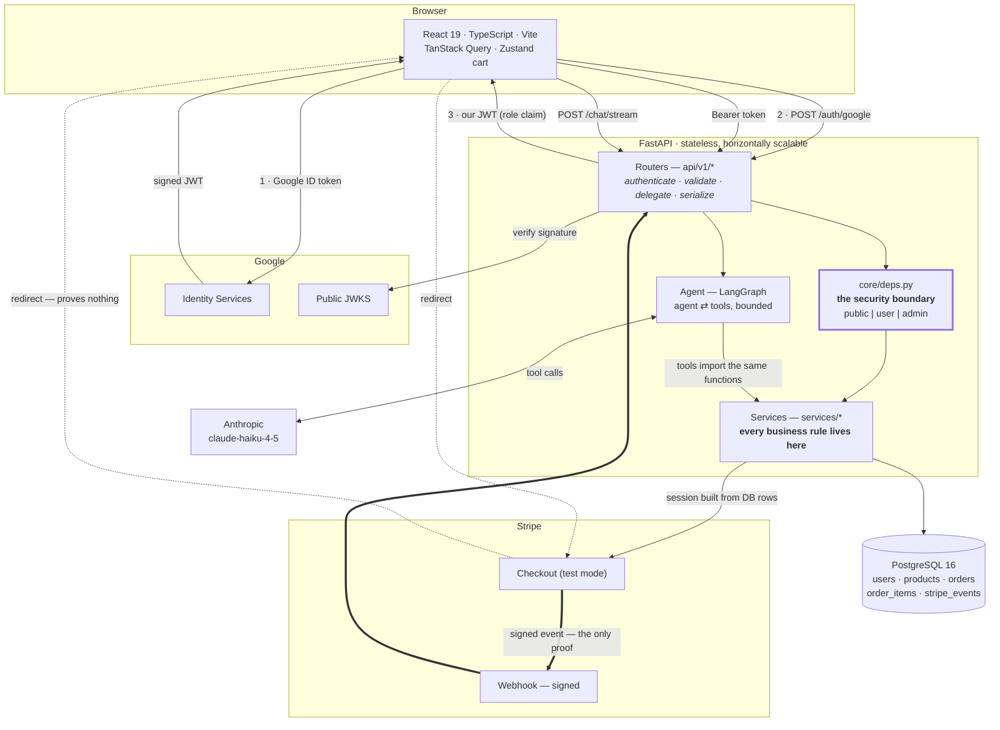
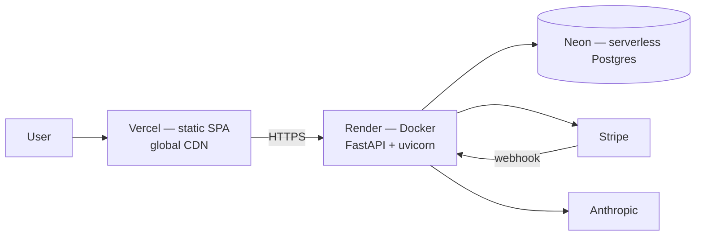

# System design

One page on how the pieces fit, followed by the scaling answer the brief asks for.

---

## The architecture



**The rule the whole backend hangs off:**

> Routers do HTTP. Services do business logic. **The AI agent calls services, not HTTP.**

Every rule — stock, totals, ownership, state transitions — lives in `services/` and nowhere else.
The agent's tools import the *same functions* the routers call. Two consequences:

1. **The AI physically cannot bypass a business rule**, because there is no second code path to
   bypass it through. A rule is enforced once, in the function both callers share.
2. There is no localhost-calling-itself. An agent issuing HTTP requests back into its own API would
   burn a worker, need a token to impersonate the user, and double the failure surface.

Services never import `HTTPException`; domain exceptions map to status codes in one handler. That is
what keeps them callable from the agent.

---

## The two integration flows

### Google Sign-In

```
Browser → Google Identity Services → signed ID token
        → POST /auth/google
        → verify RS256 against Google's live JWKS   ← never decode-without-verify
        → find-or-create user (match on stable `sub`, fall back to email)
        → assign role from ADMIN_EMAILS
        → issue OUR access + refresh tokens
```

Our token carries `role`, which Google knows nothing about, so RBAC needs no extra lookup. The app
needs only an **authorized JavaScript origin** in Google Cloud — no redirect URI, no client secret
in the browser.

`get_current_user` re-reads the user from the database on every request. One indexed lookup buys
immediate revocation, and means a token minted with `role: admin` for a customer's id grants
nothing.

### Stripe payment

```
POST /orders                      → total recomputed from DB; stock locked and reserved
POST /payments/create-checkout-session → Stripe session built from the ORDER, not the cart
Browser → Stripe Checkout → card
Stripe  → POST /payments/webhook  → signature verified
                                  → event id inserted into stripe_events FIRST
                                  → order → paid
Browser ← redirect to /checkout/success → POLLS the order until the webhook lands
```

Two properties carry this, and both come from how Stripe actually behaves rather than from the
happy path:

- **The redirect proves nothing.** It is a client-side navigation a user can perform by typing a
  URL. Only the signed, server-to-server webhook moves an order to `paid`. The success page shows
  "confirming your payment" until it does — honest, and what real checkouts do.
- **Delivery is at-least-once.** The handler records the event id *before* doing any work; a unique
  violation means "already handled". Without it, the first retry decrements stock twice.

---

## Deployment



| Piece | Where | Why |
|---|---|---|
| Frontend | Vercel | static build on a CDN; nothing to run |
| API | Render (Docker, free tier) | container parity with local; the same image runs both |
| Database | Neon | serverless Postgres, scale-to-zero, branching for previews |

**Known limitation, stated rather than hidden:** Render's free tier sleeps after ~15 minutes idle
and cold-starts in roughly 50 seconds. `/health` exists partly so the demo can be warmed before the
interview, and the frontend's network error message says the server may be waking rather than
showing a generic failure. On a paid tier this disappears.

### If this were on AWS instead

The shape the brief asks about, with the same code:

| Piece | AWS |
|---|---|
| API | **ECS Fargate** behind an **ALB** — stateless containers, no servers to patch |
| Database | **RDS PostgreSQL Multi-AZ**, with **PgBouncer** in front |
| Cache | **ElastiCache (Redis)** — catalogue reads, rate limits, agent semantic cache |
| Static + media | **S3 + CloudFront** |
| Secrets | **Secrets Manager**, injected as task env — the code already reads only env vars |
| Async work | **SQS + Lambda** for webhook processing and long agent turns |
| Observability | **CloudWatch** + OpenTelemetry traces |

Nothing in the application would change: it is stateless, configured entirely by environment, and
already containerised.

---

## Scaling: *"if users and AI requests increased significantly"*

Ordered by when each would actually start hurting, not by interest.

### 1 · The API scales sideways for free

JWTs mean no server-side sessions, so any instance can serve any request. Add instances behind the
load balancer. Nothing to do — the design already permits it, which is most of the point of having
made it stateless.

### 2 · The database hurts first

- **Connection exhaustion before CPU.** Postgres allocates a process per connection; a few dozen
  API instances × a 10-connection pool exhausts a small instance while it is nearly idle.
  **PgBouncer** in transaction mode is the fix and the first thing to add.
- **Read replicas** for the catalogue. Product reads dwarf writes; orders stay on the primary.
- **Indexes are already in place** for the queries that matter — `products(is_active, category)`,
  `orders(user_id, created_at)`, `products.slug`. Worth restating because an index added after the
  table is large is a very different operation.
- **Product search** is `ILIKE` today, which is a sequential scan. Honest about it: the fix is a
  `tsvector` column with a GIN index, then a search service if that stops being enough. At twelve
  products, adding either now would be unjustifiable.

### 3 · Cache the catalogue

A very high read:write ratio, so Redis in front of product reads removes most database load.
Invalidate on admin write rather than expiring on a timer — a stale price is a customer-facing bug,
and the write is the moment we know it changed.

### 4 · The AI path is the expensive one

This is the part the question is really about. Ranked by effect per unit of effort:

1. **Semantic cache.** Most support traffic is the same handful of questions. Embed the question,
   match against recent answers above a similarity threshold, and serve the cached reply. This is
   the single largest cost reduction available.
2. **Route by intent.** "What do you sell?" is a catalogue lookup, not a reasoning task. Classify
   cheaply, answer deterministically where possible, and escalate to the model only when the
   question genuinely needs it. The cheapest token is the one never sent.
3. **Per-user rate limits and a global spend cap.** Already implemented per user, in-process. At
   scale the counter moves to Redis so it is shared across instances — same sliding-window logic,
   one `ZADD`/`ZCOUNT` per request. The global cap is the circuit breaker that turns a runaway loop
   into a degraded feature rather than an invoice.
4. **Queue long turns.** A multi-tool turn can occupy a web worker for seconds. Push it to SQS,
   process on workers, stream results back over the existing SSE channel. The API stops being
   blocked by the slowest thing it does.
5. **Prompt caching** on the system prompt and tool definitions, which are identical on every
   request and are most of the input tokens.
6. **Bound the loop** — already done: `agent_max_steps` caps tool iterations, so a confused model
   cannot spend money indefinitely.

Streaming is already in place. It does not reduce cost, but it changes perceived latency enough
that a slower, cheaper model becomes acceptable — which does.

### 5 · Webhooks must never be lost

Currently processed inline, which is correct at this size and fast enough. Under load: enqueue on
receipt, acknowledge Stripe immediately, process on workers with retries and a dead-letter queue.
The `stripe_events` ledger already makes redelivery safe, so this is a deployment change rather
than a redesign.

### 6 · Static and media

Product images are SVG served from the frontend's origin, so they are already on Vercel's CDN. Real
product photography would go to S3 + CloudFront with responsive sizes.

### 7 · Observability

Structured JSON logs with a correlation id are already there. Add: OpenTelemetry traces spanning
API → database → Stripe → Anthropic, a token-spend dashboard broken down per user, and alerts on
webhook failure rate, agent error rate and p99 checkout latency. **Spend is a first-class metric
here** — for an LLM feature it is as operationally important as latency, and it is the one nobody
instruments until the first surprising invoice.

---

## What I would deliberately *not* add yet

Knowing when not to reach for something is worth as much as knowing the something exists.

- **No message broker for orders.** Order creation is one short transaction. Kafka would add an
  operational component and eventual consistency in exchange for nothing.
- **No microservices.** A modular monolith with a strict service layer is the right shape at this
  size. The seam is already there — `services/` — so extraction is possible later if a genuine
  scaling boundary appears. Splitting now buys distributed transactions and a much harder debug
  story.
- **No CQRS or event sourcing.** The read and write models are the same shape.
- **No Redis yet.** With one API instance the in-process rate limiter is correct and free. It
  becomes wrong the moment there are two, and that is exactly when to add Redis — not before.
- **No custom auth.** Google handles identity; we handle authorization. Storing passwords would add
  the largest security liability in the system in exchange for nothing.

Each of these is a real decision with a stated trigger for revisiting it, rather than an omission.
